# Bandit Wargame Progress 

**This repository documents my progress through the Bandit wargame, a beginner-friendly Linux and command-line challenge designed to build foundational skills in shell usage, file handling, and basic security concepts.**

**I will continue updating this repository as I progress through higher levels, gradually expanding both the solutions and the learning notes.**
# Bandit1

# Bandit2

# Bandit3

# Bandit4

# Bandit5

# Bandit6

# Bandit7

# Bandit8

# Bandit9

# Bandit10

# Bandit11

# Bandit12

# Bandit13

# Bandit14

# Bandit15

# Bandit16

# Bandit17

# Bandit18

# Bandit19

# Bandit20
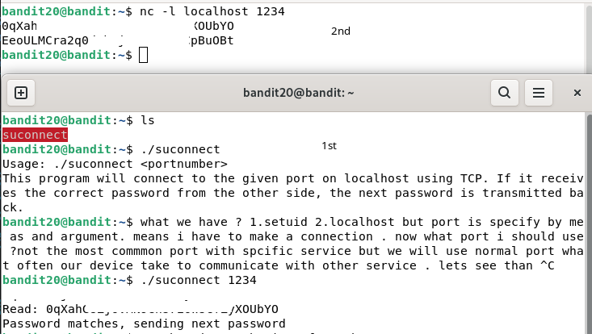

# Bandit21
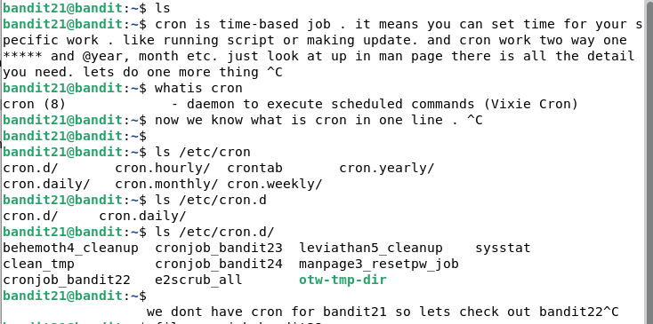

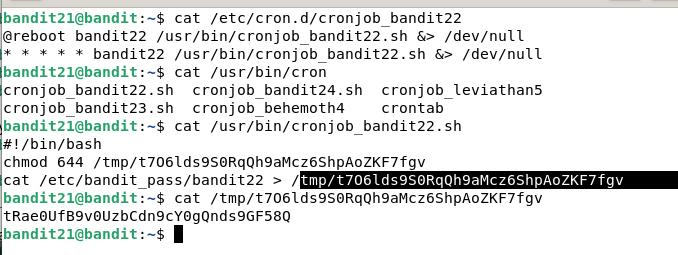

# Bandit22
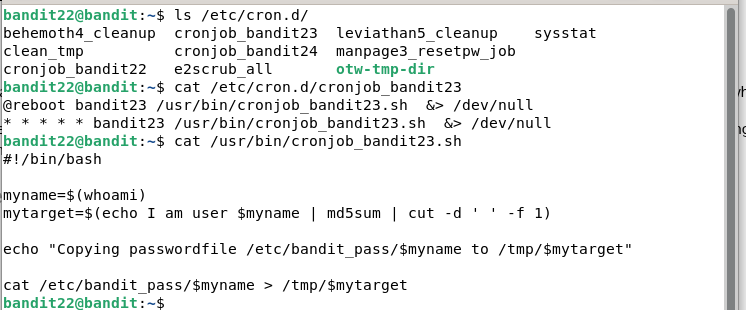

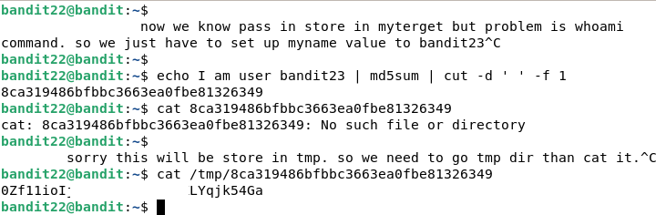

# Bandit23
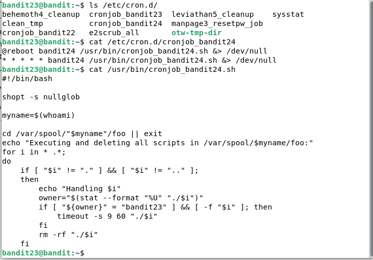

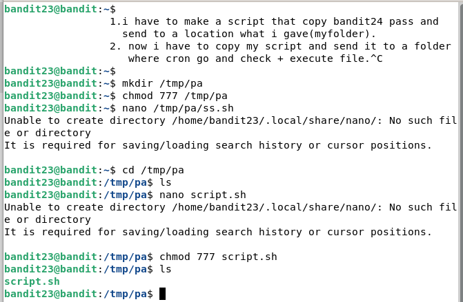

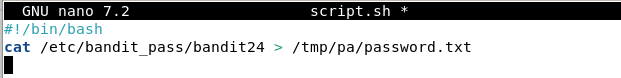

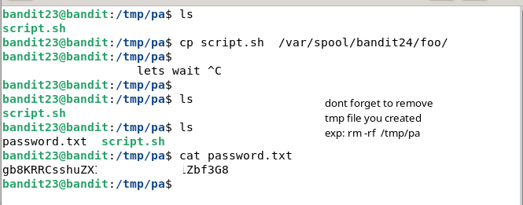

# Bandit24
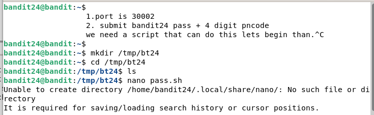

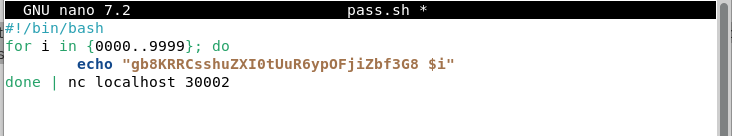

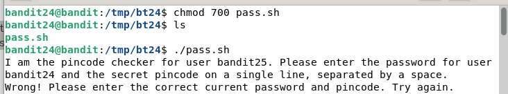

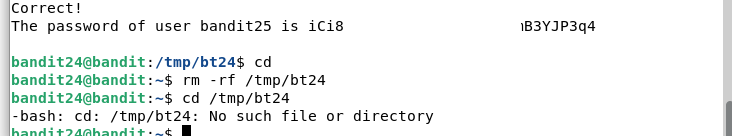

# Bandit25
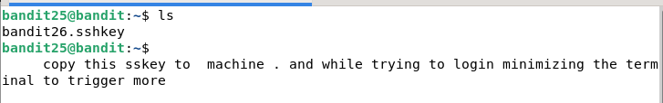

**note:** when you see more than press v to enter vim. than you have to set shell.

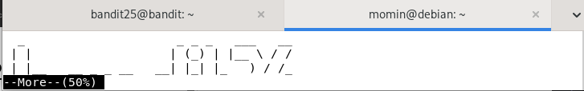

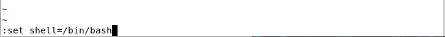

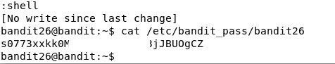

**note:** complete 26 as well its easy and it same as bandit19 ( bandit19-20). and dont forget to log out properly
# Bandit26
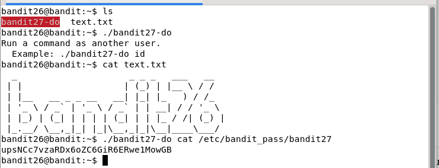

**note** write exit then :qa! or :q! to quite. 

# Bandit27

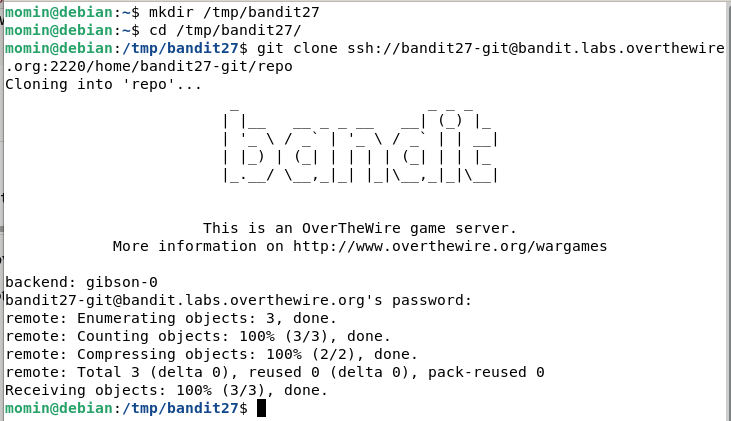

- git clone have flag for port. :2220 added after hostname.

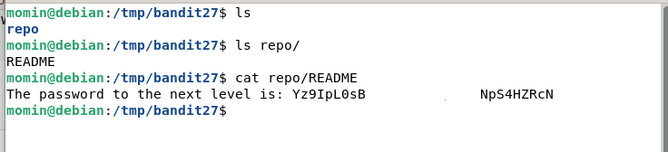
## Resources

**basic git**
>checkout my this repo it will help you to understand basic (bare minimum) git.

- [Git Notes](https://github.com/redowanislammomin/cybersecurity-notes/blob/main/Basic-git/git.md)

## Bandit28

- git clone same way as bandit27 after host name add port number (bandit28-git@bandit......org **:2220**)

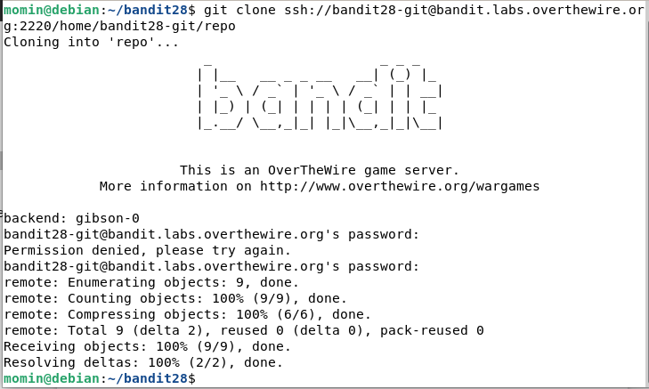

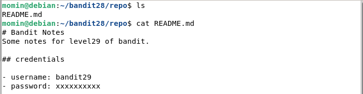

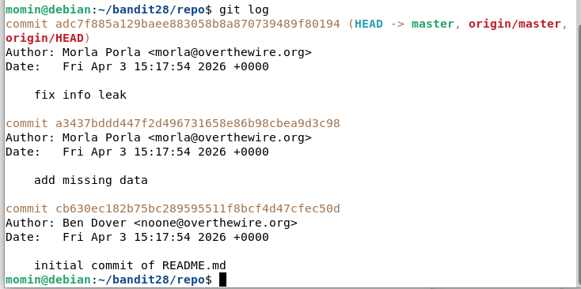

- in 3rd pic i can see log so i will start with first/old hash to check what was changed than we might able to find pass.

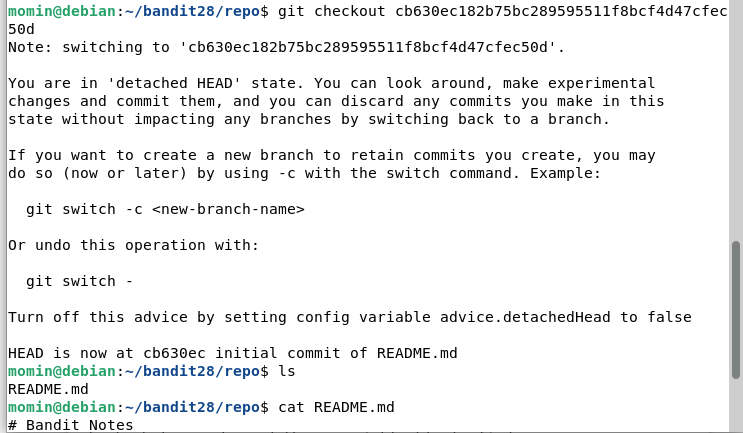

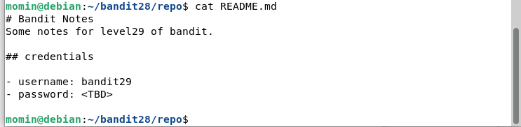

we didnt found anything but we know pass has not decided yet 

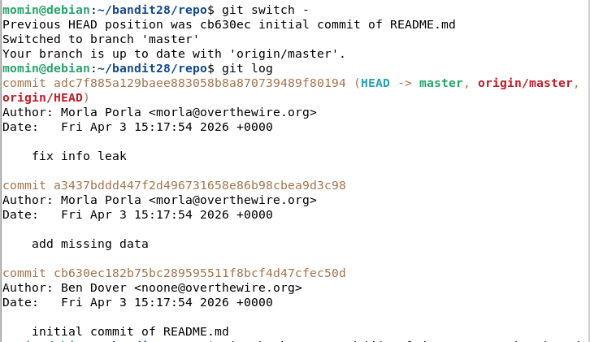

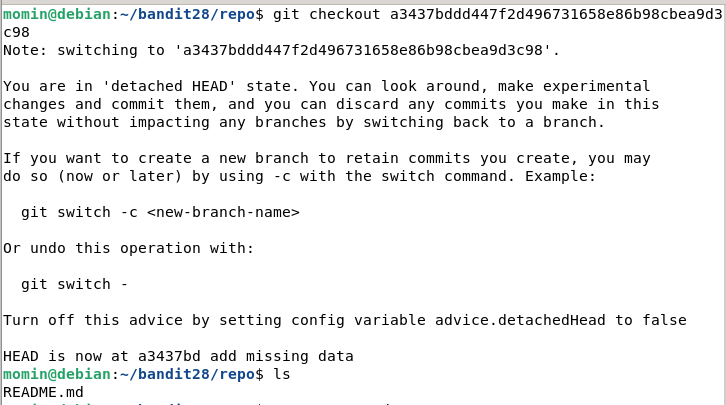

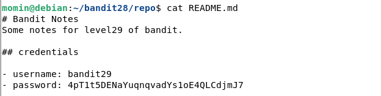
## Resources

**basic git**
>checkout my this repo it will help you to understand basic (bare minimum) git.

- [Git Notes](https://github.com/redowanislammomin/cybersecurity-notes/blob/main/Basic-git/git.md)

# Bandit29

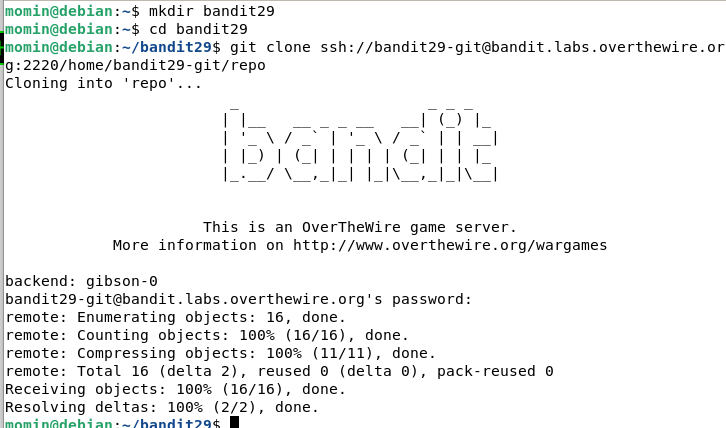

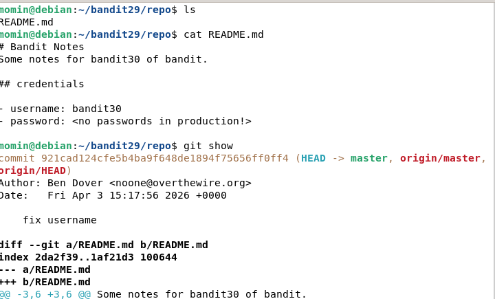

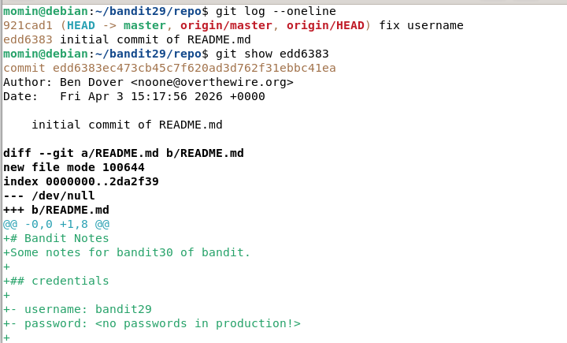

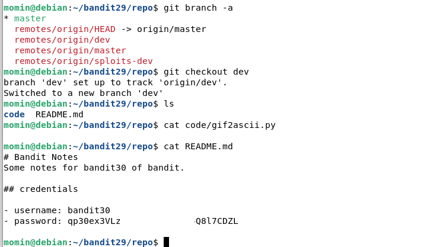

## Resources

**basic git**
>checkout my this repo it will help you to understand basic (bare minimum) git.

- [Git command sheet](https://github.com/redowanislammomin/cybersecurity-notes/blob/main/Basic-git/git-command-sheet.md)
- in this sheet you will find mostly common command people use in git.
- dont have to memorize as long as you know command exist for this job or any job you are doing and know how to find it. nobody memorize all of that. 
